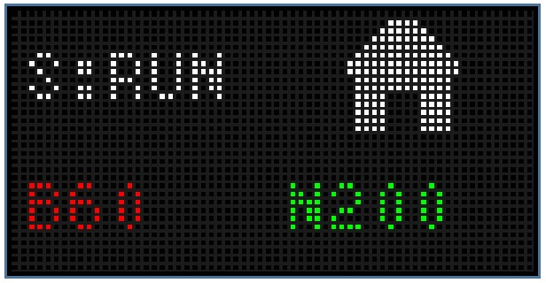

A real-time status display for [BambuLab](https://bambulab.com/) 3D printers on 64x32 RGB LED matrices

### 💻 Display Screenshots


<p align="center"><h6>This shows that the printer is currently running and the bed is at 60°c and the nozzle is at 200°c. It's currently homing all axes.</h6></p>

## 🚩 Hack Club

This project was created as part of the Neon [Hack Club](https://hackclub.com/) YSWS.

## ‼️ Important

This is a work in progress!
Currently only tested on a BambuLab A1 & A1 mini, but the bambulab-api package should work on any BambuLab printer. 

## ✨ Features
- Live printer status monitoring
- Temperature displays (bed/nozzle)
- Animated Images for different states

## ⚙️ Installation
1. Install [CircuitPython](https://circuitpython.org/) on your microcontroller
2. Install required libraries:
   ```bash
   circup install adafruit_rgbmatrix adafruit_displayio displayio
   pip install bambulabs-api
   ```
3. Clone repo & configure:
   ```bash
   git clone https://github.com/roschreiber/bambulab-neon.git
   ```

## 🔧 Configuration
Update `neon.py` with your printer details:

```python
IP = 'xxx.xxx.xxx.xxx' # IP address of your printer
SERIAL = 'xxxxxx' # Serial number of your printer
ACCESS_CODE = 'xxxxxx' # Access code of your printer (found in LAN Only Mode Tab)
```

## 📜 License
MIT License - See [LICENSE](LICENSE) for details